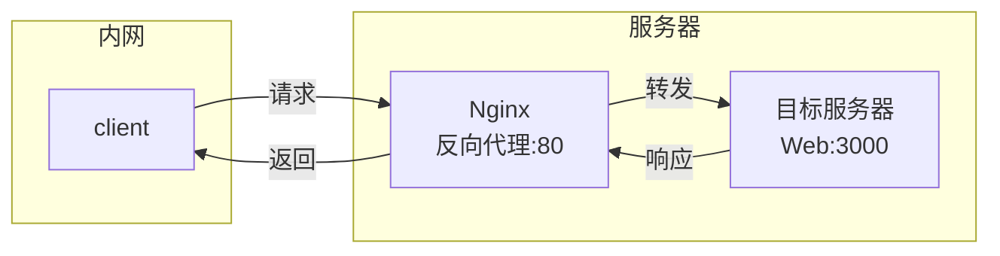

---
title：应用
---

## 正向代理

- 在==客户端==添加代理的方式实现访问服务器，返回内容
- 隐藏client的ip，有点像路由器网关(NAT)，但是它是在网络层，nginx实在应用层，需要手动操作，翻墙

- ```mermaid
  
  graph LR
  	subgraph 内网
  		A[client]
  		B[Nginx<br/>正向代理:80]
      end
      A -- 请求 --> B
      B -- 转发 --> C[目标服务器<br/>Web:3000]
      C -- 响应 --> B
      B -- 返回 --> A
      
  ```


## 反向代理

- 在==目标服务器==前添加反向代理服务器，此时只要我们将请求发送到反向代理服务器 ，它就会去选择目标服务器，在返回client。
- 此时反向代理服务器和目标服务器对外就是一个服务器，暴露的是代理服务器的ip，隐藏真实的ip



## 负载均衡

- 服务器访问量增加时，通过增加服务器的数量，将请求分发到各个服务器上。

## 动静分离

- 将服务器的动态资源和静态资源分开进行部署，nginx根据client的请求转发给对应的服务器

## 测试nginx语法

- `nginx -t`
